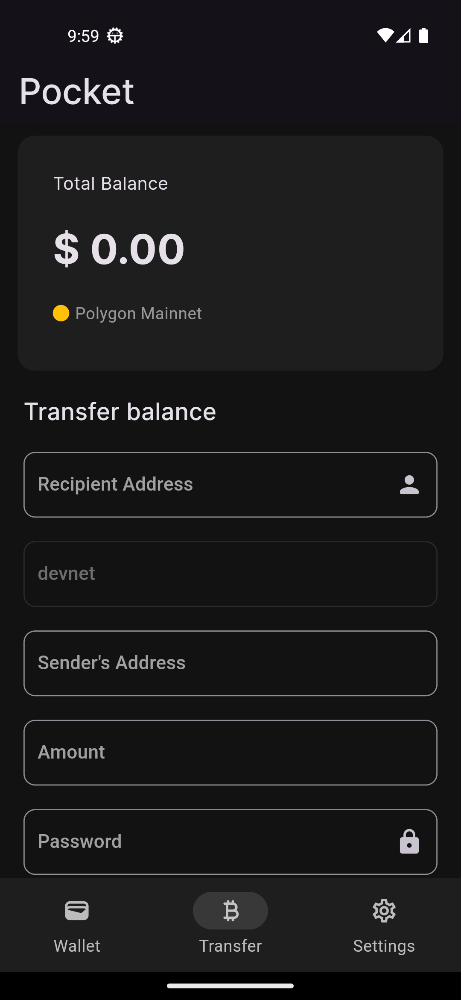
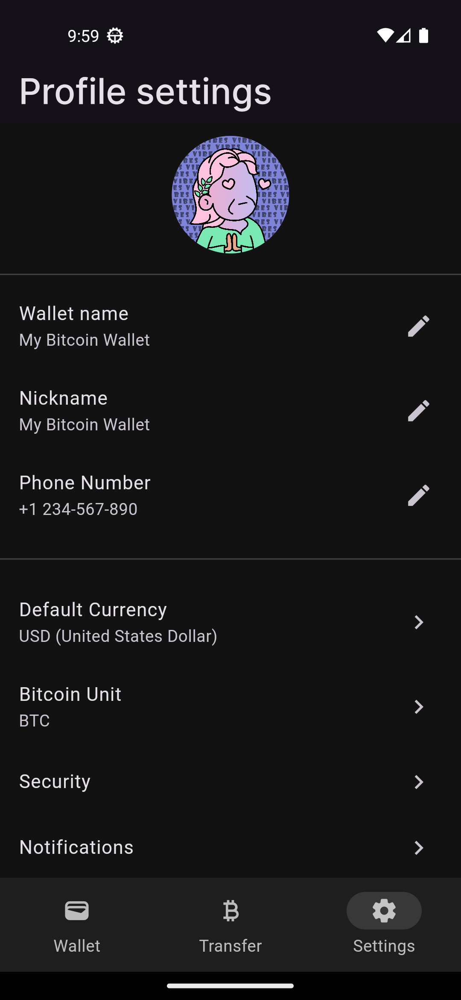

# Pocket

A Flutter application that mimics the wallet functionality found in the Vible Wallet App.
The app performs various wallet-related operations by integrating with the provided APIs.
Key functionalities include wallet creation, balance transfer, balance retrieval, and airdrop
requests.

## Overview

This assignment involves creating a simple wallet application using Flutter. The application
replicates the wallet features found in the specified app. The required APIs are 
integrated into the Flutter app to handle various wallet operations. The aim is to
demonstrate a good understanding of Flutter, API integration, state management with Provider,
and mobile app development best practices.

## Screenshots

     

